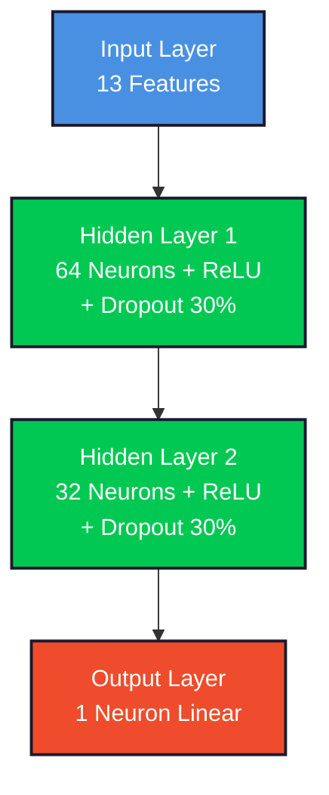

<div align="center">
  
  
  <h1>
    
  </h1>
  
  <samp>UFRN · Electrical Engineering · ELE 604 – Artificial Neural Networks</samp>
  <br/><br/>
  
  
  
  
  
</div>

<br/>

## `> project.overview()`

```python
class NeuralRegressionProject:
    def __init__(self):
        self.title = "Generalization Analysis in Neural Networks"
        self.subtitle = "Real Estate Price Regression with K-Fold Cross-Validation"
        self.dataset = "Boston Housing (506 instances, 13 features)"
        self.institution = "UFRN - Federal University of Rio Grande do Norte"
        self.department = "Center of Technology - Electrical Engineering Dept."
        self.course = "ELE 604 - Artificial Neural Networks"
        self.professor = "Prof. Dr. Allan de Medeiros Martins"
        self.author = "Cauã Vitor Figueredo Silva"
        self.student_id = "20220014216"
        self.email = "cauavitorfigueredo@gmail.com"
        self.date = "November 2025"
        self.python_version = "3.12"
    
    def architecture(self):
        return {
            "type": "Multi-Layer Perceptron (MLP)",
            "layers": [13, 64, 32, 1],
            "activation": "ReLU",
            "optimizer": "Adam (lr=0.001)",
            "loss": "Mean Squared Error",
            "regularization": ["Dropout (30%)", "L2 (1e-4)"]
        }
    
    def mlops_practices(self):
        return [
            "K-Fold Cross-Validation (K=5)",
            "Bayesian Optimization (Optuna)",
            "Early Stopping (patience=20)",
            "Model Checkpointing",
            "Data Leakage Prevention",
            "Reproducibility (Seed=42)",
            "Hyperband Pruning"
        ]
    
    def final_results(self):
        return {
            "base_model": {"MSE": 13.47, "R²": 0.8525, "std": 2.47},
            "optimized_model": {"MSE": 13.02, "R²": 0.8574, "std": 4.62},
            "improvement": "3.3% MSE reduction via Bayesian Optimization",
            "conclusion": "Good Generalization Achieved"
        }
```

<br/>

## `> tech_stack`

<div align="center">
  
</div>

<table align="center">
<tr>
<td align="center" width="33%">
<strong>🧠 Deep Learning</strong><br/><br/>


</td>
<td align="center" width="33%">
<strong>📊 ML Pipeline</strong><br/><br/>


</td>
<td align="center" width="33%">
<strong>🔧 Development</strong><br/><br/>


</td>
</tr>
</table>

<br/>

## `> project_structure`

```
ufrn-ele-neural-regression/
│
├── 📊 data/
│   ├── raw/                    # Boston Housing CSV (from CMU)
│   └── processed/              # Normalized datasets
│
├── 🧠 src/
│   ├── dataset.py              # Data loading & PyTorch Dataset
│   ├── model.py                # MLP architecture with regularization
│   ├── train.py                # Training loops & validation
│   └── visualization.py        # Learning curves & scatter plots
│
├── 📓 notebooks/
│   └── project_main.ipynb      # Complete experimental workflow
│
├── 💾 models/                  # Best model checkpoints (per fold)
│
├── 📄 reports/
│   ├── relatorio_final.tex     # LaTeX report (ABNT format)
│   ├── referencias.bib         # Bibliography (BibLaTeX)
│   └── figures/                # Generated plots and diagrams
│       ├── kfold_results.png
│       ├── optuna_optimization_history.png
│       ├── learning_curves.png
│       ├── learning_curves_optimized.png
│       ├── predictions_scatter.png
│       └── predictions_scatter_optimized.png
│
├── requirements.txt            # Python 3.12 dependencies
├── .gitignore
└── README.md
```

<br/>

## `> methodology`

<table align="center">
<tr>
<td width="50%">
<h3 align="center">📐 K-Fold Cross-Validation</h3>
<p align="center">

</p>
<p><samp>Divides the dataset into 5 folds, training on 4 and validating on 1 each iteration. Ensures robust performance estimation in small datasets (506 samples).</samp></p>

**Key Benefits:**
- Reduces variance in performance metrics
- Every sample serves as validation once
- Provides mean ± std for statistical confidence
</td>
<td width="50%">
<h3 align="center">🛡️ Data Leakage Prevention</h3>
<p align="center">

</p>
<p><samp>StandardScaler is fitted <strong>only</strong> on training data within each fold. Validation data is transformed using training statistics, preventing information leakage.</samp></p>

**Critical Rule:**
```python
scaler.fit(X_train)       # ✓ Correct
X_val = scaler.transform(X_val)  # ✓ No fit!
```
</td>
</tr>
</table>

<br/>

## `> model_architecture`

<div align="center">



</div>

<table align="center">
<tr>
<td align="center"><strong>Component</strong></td>
<td align="center"><strong>Configuration</strong></td>
<td align="center"><strong>Justification</strong></td>
</tr>
<tr>
<td align="center">Optimizer</td>
<td align="center"><code>Adam</code></td>
<td align="center">Adaptive learning rate with momentum</td>
</tr>
<tr>
<td align="center">Learning Rate</td>
<td align="center"><code>0.001</code></td>
<td align="center">Stable convergence without overshooting</td>
</tr>
<tr>
<td align="center">Loss Function</td>
<td align="center"><code>MSELoss</code></td>
<td align="center">Standard for regression tasks</td>
</tr>
<tr>
<td align="center">Batch Size</td>
<td align="center"><code>16</code></td>
<td align="center">Balances memory and gradient stability</td>
</tr>
<tr>
<td align="center">Dropout Rate</td>
<td align="center"><code>0.3 (30%)</code></td>
<td align="center">Prevents overfitting via stochastic regularization</td>
</tr>
<tr>
<td align="center">Weight Decay (L2)</td>
<td align="center"><code>1e-4</code></td>
<td align="center">Penalizes large weights, smooths decision surfaces</td>
</tr>
<tr>
<td align="center">Early Stopping</td>
<td align="center"><code>patience=20</code></td>
<td align="center">Stops when validation loss plateaus</td>
</tr>
<tr>
<td align="center">Max Epochs</td>
<td align="center"><code>500</code></td>
<td align="center">Upper bound (typically stops at ~150-200)</td>
</tr>
</table>

<br/>

## `> regularization_techniques`

<table align="center">
<tr>
<td align="center" width="33%">
<strong>🎲 Dropout (30%)</strong><br/><br/>
<samp>
Randomly "drops" neurons during training, forcing the network to learn redundant representations. Reduced train-val gap from <strong>181%</strong> to <strong>~35%</strong>.
</samp>
</td>
<td align="center" width="33%">
<strong>⚖️ L2 Regularization</strong><br/><br/>
<samp>
Adds penalty term λ∑w² to loss function. Prevents weight explosion and creates smoother decision boundaries. Used λ = <strong>1e-4</strong>.
</samp>
</td>
<td align="center" width="33%">
<strong>⏹️ Early Stopping</strong><br/><br/>
<samp>
Monitors validation loss and stops training after 20 epochs without improvement. Saves <strong>60-70%</strong> computation time while preserving best model.
</samp>
</td>
</tr>
</table>

<br/>

## `> bayesian_optimization`

<div align="center">

### 🎯 Optuna Hyperparameter Search


</div>

**Search Space (8 Hyperparameters):**

| Hyperparameter | Range/Options | Type |
|---------------|---------------|------|
| Number of Layers | `{1, 2, 3}` | Categorical |
| Hidden Units | `{16, 32, 64, 128}` | Categorical |
| Dropout Rate | `[0.1, 0.5]` | Continuous |
| Learning Rate | `[1e-4, 1e-2]` | Log-uniform |
| Weight Decay | `[1e-6, 1e-3]` | Log-uniform |
| Batch Size | `{8, 16, 32}` | Categorical |
| Optimizer | `{Adam, RMSprop}` | Categorical |
| Batch Normalization | `{True, False}` | Boolean |

**Results:**
- **Best MSE:** 13.02 (3.3% improvement over base model)
- **Time Saved:** ~70% via Hyperband Pruner (early trial termination)
- **Computation:** 20 trials × K=3 folds = 60 training runs (~25 minutes)

<br/>

## `> installation`

```bash
# Clone repository
git clone https://github.com/takaokensei/ufrn-ele-neural-regression.git
cd ufrn-ele-neural-regression

# Create virtual environment (Python 3.12 required)
python3.12 -m venv venv
source venv/bin/activate  # Linux/Mac
# or
venv\Scripts\activate  # Windows

# Install dependencies
pip install -r requirements.txt

# Launch Jupyter Notebook
jupyter notebook notebooks/project_main.ipynb
```

### Dependencies (`requirements.txt`)

```
torch==2.0.1
torchvision==0.15.2
numpy==1.24.3
pandas==2.0.2
scikit-learn==1.3.0
matplotlib==3.7.1
seaborn==0.12.2
jupyter==1.0.0
notebook==6.5.4
requests==2.31.0
optuna==3.3.0
```

<br/>

## `> dataset_analysis`

<div align="center">

### 📊 Boston Housing Dataset

**Source:** [Carnegie Mellon University Statistical Library](http://lib.stat.cmu.edu/datasets/boston)


</div>

| Feature | Description | Type |
|---------|-------------|------|
| `CRIM` | Per capita crime rate by town | Continuous |
| `ZN` | Proportion of residential land zoned for large lots (>25k sqft) | Continuous |
| `INDUS` | Proportion of non-retail business acres per town | Continuous |
| `CHAS` | Charles River proximity (1 if tract bounds river, 0 otherwise) | Binary |
| `NOX` | Nitric oxides concentration (parts per 10 million) | Continuous |
| `RM` | Average number of rooms per dwelling | Continuous |
| `AGE` | Proportion of owner-occupied units built prior to 1940 | Continuous |
| `DIS` | Weighted distances to five Boston employment centers | Continuous |
| `RAD` | Index of accessibility to radial highways | Discrete |
| `TAX` | Full-value property tax rate per $10,000 | Continuous |
| `PTRATIO` | Pupil-teacher ratio by town | Continuous |
| `B` | 1000(Bk - 0.63)² where Bk is proportion of Black residents | Continuous |
| `LSTAT` | Percentage of lower status population | Continuous |
| **`MEDV`** | **Median value of owner-occupied homes in $1000s** | **Target** |

<br/>

## `> results_summary`

<table align="center">
<tr>
<td width="50%" align="center">
<h3>📊 Base Model Performance</h3>

| Metric | Value |
|--------|-------|
| **Mean MSE** | 13.47 |
| **Std Dev** | 2.47 |
| **Mean R²** | 0.8525 |
| **Prediction Error** | ~$3,670 |


</td>
<td width="50%" align="center">
<h3>🎯 Optimized Model (Optuna)</h3>

| Metric | Value |
|--------|-------|
| **Mean MSE** | 13.02 |
| **Std Dev** | 4.62 |
| **Mean R²** | 0.8574 |
| **Prediction Error** | ~$3,608 |


</td>
</tr>
</table>

### 📈 Key Insights

<table align="center">
<tr>
<td align="center" width="25%">
<strong>🎓 Overfitting Reduction</strong><br/><br/>
<samp>Train-val gap decreased from <strong>181%</strong> (no regularization) to <strong>~35%</strong> (with Dropout + L2)</samp>
</td>
<td align="center" width="25%">
<strong>⚡ Early Stopping Impact</strong><br/><br/>
<samp>Training stopped at <strong>150-200</strong> epochs (vs max 500), saving <strong>60-70%</strong> computation time</samp>
</td>
<td align="center" width="25%">
<strong>🔍 Cross-Validation Stability</strong><br/><br/>
<samp>Base model showed lower variance (σ=2.47) across folds, indicating more stable predictions</samp>
</td>
<td align="center" width="25%">
<strong>🎯 Optuna Efficiency</strong><br/><br/>
<samp>Tested 20 configurations in <strong>~25 minutes</strong> vs <strong>5+ hours</strong> for exhaustive Grid Search</samp>
</td>
</tr>
</table>

<br/>

## `> visualizations`

<div align="center">

### 📉 Learning Curves: Train vs Validation Loss

<table>
<tr>
<td align="center">
<strong>Base Model (Dropout + L2)</strong><br/>
<br/>
Smooth convergence with reduced gap
</td>
<td align="center">
<strong>Optimized Model (Optuna)</strong><br/>
<br/>
Best performance via Bayesian Optimization
</td>
</tr>
</table>

### 🎯 Predictions vs Ground Truth

<table>
<tr>
<td align="center">
<strong>Base Model Scatter Plot</strong><br/>
<br/>
Strong linear correlation
</td>
<td align="center">
<strong>Optimized Model Scatter Plot</strong><br/>
<br/>
Excellent alignment with y=x line
</td>
</tr>
</table>

### 🔬 Optuna Optimization History

**Three-Panel Analysis:**
1. **Left Panel:** Progressive MSE reduction across 20 trials
2. **Center Panel:** Hyperparameter importance ranking
3. **Right Panel:** Final MSE distribution (convergence visualization)

</div>

<br/>

## `> development_timeline`

<div align="center">

### ⚡ Rapid Development: Complete Implementation in 1 Day


</div>

```
📅 November 2025 - Intensive Development Session

┌─ Hour 00-01: Infrastructure Setup
│  • Initial commit & project structure
│  • Dependencies configuration
│
├─ Hour 01-03: Core Implementation  
│  • MLP architecture with PyTorch
│  • K-Fold cross-validation pipeline
│  • StandardScaler integration
│
├─ Hour 03-05: Regularization Phase
│  • Dropout (30%) implementation
│  • L2 Weight Decay integration
│  • Early Stopping mechanism
│
├─ Hour 05-08: Optimization & SOTA
│  • Bayesian Optimization with Optuna (20 trials)
│  • Hyperband Pruner for efficiency
│  • BatchNorm compatibility fixes
│
├─ Hour 08-12: Results & Analysis
│  • Complete notebook execution
│  • Learning curves generation
│  • Scatter plots (predictions vs real)
│  • Optuna visualization panels
│
├─ Hour 12-16: LaTeX Report (ABNT)
│  • Report structure & formatting
│  • Methodology documentation
│  • Results integration with figures
│  • Bibliography (BibLaTeX)
│
└─ Hour 16-20: Final Polish
   • README design revamp (6 iterations)
   • PDF compilation & fixes
   • Bibliography references
   • Documentation finalization
```

### 🔥 Commit Highlights

| Phase | Commits | Key Features |
|-------|---------|--------------|
| **🏗️ Foundation** | `1a41d49` → `a01397e` | Project initialization, structure setup |
| **🧠 Core ML** | `c0f102a` → `f387f58` | MLP implementation, K-Fold validation |
| **🛡️ Regularization** | `7f2d959` → `d5906b1` | Dropout, L2, Early Stopping |
| **🎯 SOTA** | `6cc0f13` → `d5906b1` | Optuna Bayesian Optimization |
| **📊 Analysis** | `56d5fcd` → `d19df02` | Notebook execution, results generation |
| **📄 Documentation** | `4757546` → `608fb49` | LaTeX report, README polish (6 revisions) |

### 💡 Development Philosophy

<table align="center">
<tr>
<td align="center" width="33%">
<strong>🚀 Move Fast</strong><br/><br/>
<samp>Intensive 20-hour sprint with focused implementation. Rapid prototyping followed by iterative refinement.</samp>
</td>
<td align="center" width="33%">
<strong>🔬 Experiment Driven</strong><br/><br/>
<samp>Multiple optimization trials (Optuna), A/B testing regularization techniques, continuous validation.</samp>
</td>
<td align="center" width="33%">
<strong>📚 Document Later</strong><br/><br/>
<samp>Code first, polish documentation after results validation. 6 README iterations for clarity.</samp>
</td>
</tr>
</table>

<br/>

## `> key_concepts`

<table align="center">
<tr>
<td align="center" width="33%">
<strong>📐 Bias-Variance Tradeoff</strong><br/><br/>
<samp>
<strong>High Bias (Underfitting):</strong> Model too simple, high error on train & val<br/><br/>
<strong>High Variance (Overfitting):</strong> Model too complex, memorizes training data<br/><br/>
<strong>Optimal Balance:</strong> Minimizes both simultaneously
</samp>
</td>
<td align="center" width="33%">
<strong>🔄 K-Fold Validation</strong><br/><br/>
<samp>
Divides data into K partitions. Each fold serves as validation once while others train. Final metric = mean ± std across all folds. Essential for small datasets.
</samp>
</td>
<td align="center" width="33%">
<strong>🎲 Regularization</strong><br/><br/>
<samp>
<strong>Dropout:</strong> Randomly disables neurons (30%)<br/><br/>
<strong>L2 Penalty:</strong> Adds λ∑w² to loss<br/><br/>
<strong>Early Stop:</strong> Halts when val loss plateaus
</samp>
</td>
</tr>
</table>

<br/>

## `> future_enhancements`

<table align="center">
<tr>
<td align="center" width="25%">
<strong>🏗️ Architecture</strong><br/><br/>
<samp>
• Residual connections<br/>
• Batch Normalization<br/>
• Attention mechanisms<br/>
• Ensemble learning
</samp>
</td>
<td align="center" width="25%">
<strong>🔍 Feature Engineering</strong><br/><br/>
<samp>
• Polynomial features<br/>
• Interaction terms (RM×LSTAT)<br/>
• Log transformations<br/>
• PCA dimensionality reduction
</samp>
</td>
<td align="center" width="25%">
<strong>📊 Interpretability</strong><br/><br/>
<samp>
• SHAP values analysis<br/>
• Feature importance ranking<br/>
• Partial dependence plots<br/>
• Model comparison with XGBoost
</samp>
</td>
<td align="center" width="25%">
<strong>🚀 Deployment</strong><br/><br/>
<samp>
• REST API with FastAPI<br/>
• Docker containerization<br/>
• MLflow experiment tracking<br/>
• CI/CD pipeline
</samp>
</td>
</tr>
</table>

<br/>

## `> academic_references`

This project is grounded in seminal works in Machine Learning and Neural Networks:

- **Pattern Recognition (Bishop, 2006)** - Bias-variance decomposition, regularization theory
- **Elements of Statistical Learning (Hastie et al., 2009)** - Cross-validation methodology
- **Deep Learning (Goodfellow et al., 2016)** - Early stopping, dropout techniques
- **Adam Optimizer (Kingma & Ba, 2015)** - Adaptive learning rate optimization
- **Optuna (Akiba et al., 2019)** - Bayesian hyperparameter optimization framework

Full bibliography available in LaTeX report (`reports/referencias.bib`)

<br/>

## `> citation`

```bibtex
@misc{silva2025neuralregression,
  author       = {Silva, Cauã Vitor Figueredo},
  title        = {Generalization Analysis in Neural Networks for 
                  Real Estate Price Regression with K-Fold Cross-Validation},
  year         = {2025},
  institution  = {Federal University of Rio Grande do Norte},
  department   = {Electrical Engineering},
  course       = {ELE 604 - Artificial Neural Networks},
  advisor      = {Prof. Dr. Allan de Medeiros Martins},
  type         = {Academic Project Report},
  address      = {Natal, Brazil}
}
```

<br/>

## `> latex_report`

### 📄 Compiling the Report

The project includes a comprehensive LaTeX report following **ABNT standards** (Brazilian academic formatting):

```bash
cd reports

# Compile LaTeX with BibLaTeX bibliography
pdflatex relatorio_final.tex
biber relatorio_final        # ABNT-compliant bibliography
pdflatex relatorio_final.tex
pdflatex relatorio_final.tex

# Output: relatorio_final.pdf
```

**Report Structure:**
1. **Cover Page** - Institutional branding, project title, author credentials
2. **Abstract (PT/EN)** - Executive summary with keywords
3. **Table of Contents** - Automatic navigation
4. **Introduction** - Contextualization, objectives, justification
5. **Methodology** - Dataset analysis, model architecture, training protocol
6. **Results** - Performance metrics, visualizations, statistical analysis
7. **Conclusion** - Key findings, lessons learned, future work
8. **Bibliography** - BibLaTeX references in ABNT format
9. **Appendices** - Source code, flowcharts, additional figures

<br/>

## `> contact`

<div align="center">
  
  <strong>Cauã Vitor Figueredo Silva</strong>
  <br/>
  <samp>Student ID: 20220014216</samp>
  <br/>
  <samp>Department of Electrical Engineering</samp>
  <br/>
  <samp>Center of Technology - Federal University of Rio Grande do Norte (UFRN)</samp>
  <br/>
  <samp>Natal, Rio Grande do Norte, Brazil 🇧🇷</samp>
  
  <br/><br/>
  
  <a href="mailto:cauavitorfigueredo@gmail.com">
    
  </a>
  <a href="https://github.com/takaokensei">
    
  </a>
  <a href="https://www.linkedin.com/in/cauã-vitor-7bb072286/">
    
  </a>

  <br/><br/>
  
  <strong>Academic Advisor</strong><br/>
  <samp>Prof. Dr. Allan de Medeiros Martins</samp><br/>
  <samp>ELE 604 - Artificial Neural Networks</samp>

</div>

<br/>

<div align="center">
  
  
  
</div>

