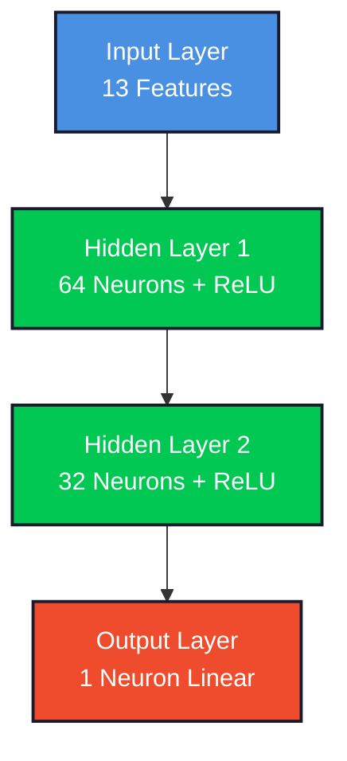
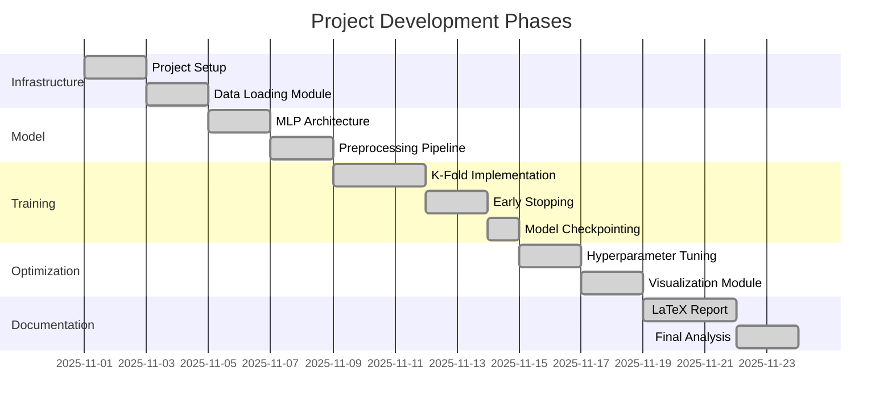

<div align="center">
  
  
  <h1>
    
  </h1>
  
  <samp>UFRN · Electrical Engineering · Neural Networks Laboratory</samp>
  <br/><br/>
  
  
  
  
  
</div>

<br/>

## `> project.overview()`

```python
class NeuralRegressionProject:
    def __init__(self):
        self.title = "Generalization Analysis in Neural Networks"
        self.task = "Real Estate Price Regression"
        self.dataset = "Boston Housing (506 instances, 13 features)"
        self.institution = "UFRN - Federal University of Rio Grande do Norte"
        self.author = "Cauã Vitor Figueredo Silva"
        self.student_id = "20220014216"
        self.date = "November 2025"
        self.python_version = "3.12"
    
    def architecture(self):
        return {
            "type": "Multi-Layer Perceptron (MLP)",
            "layers": [13, 64, 32, 1],
            "activation": "ReLU",
            "optimizer": "Adam (lr=0.001)",
            "loss": "Mean Squared Error"
        }
    
    def mlops_practices(self):
        return [
            "K-Fold Cross-Validation (K=5)",
            "Early Stopping (patience=20)",
            "Model Checkpointing",
            "Data Leakage Prevention",
            "Reproducibility (Fixed Seeds)",
            "Modular Code Architecture"
        ]
```

<br/>

## `> tech_stack`

<div align="center">
  
</div>

<table align="center">
<tr>
<td align="center" width="33%">
<strong>🧠 Deep Learning</strong><br/><br/>


</td>
<td align="center" width="33%">
<strong>📊 ML Pipeline</strong><br/><br/>


</td>
<td align="center" width="33%">
<strong>🔧 Documentation</strong><br/><br/>


</td>
</tr>
</table>

<br/>

## `> project_structure`

```
ufrn-ele-neural-regression/
│
├── 📊 data/
│   ├── raw/                    # Boston Housing CSV
│   └── processed/              # Normalized datasets
│
├── 🧠 src/
│   ├── dataset.py              # Data loading & PyTorch Dataset
│   ├── model.py                # MLP architecture
│   ├── train.py                # Training loops & validation
│   └── visualization.py        # Loss curves & scatter plots
│
├── 📓 notebooks/
│   └── project_main.ipynb      # Complete experimental workflow
│
├── 💾 models/                  # Best model checkpoints (per fold)
├── 📄 reports/                 # LaTeX documentation & figures
│
├── requirements.txt
├── .gitignore
└── README.md
```

<br/>

## `> methodology`

<table align="center">
<tr>
<td width="50%">
<h3 align="center">📐 Cross-Validation Strategy</h3>
<p align="center">

</p>
<p><samp><strong>Stratified K-Fold</strong> ensures each fold serves as validation set exactly once, preventing data leakage and providing robust performance estimates.</samp></p>

```python
from sklearn.model_selection import KFold

kf = KFold(n_splits=5, shuffle=True, 
           random_state=42)
for fold, (train_idx, val_idx) in 
    enumerate(kf.split(X)):
    # Train & validate
```
</td>
<td width="50%">
<h3 align="center">🛡️ Data Leakage Prevention</h3>
<p align="center">

</p>
<p><samp><strong>Normalization within folds</strong> ensures validation data never influences training statistics, maintaining true generalization measurement.</samp></p>

```python
scaler = StandardScaler()
# Fit ONLY on training data
X_train = scaler.fit_transform(X_train)
# Transform validation (no fit)
X_val = scaler.transform(X_val)
```
</td>
</tr>
</table>

<br/>

## `> model_architecture`

<div align="center">



</div>

<table align="center">
<tr>
<td align="center"><strong>Parameter</strong></td>
<td align="center"><strong>Value</strong></td>
<td align="center"><strong>Justification</strong></td>
</tr>
<tr>
<td align="center">Optimizer</td>
<td align="center"><code>Adam</code></td>
<td align="center">Adaptive learning rate</td>
</tr>
<tr>
<td align="center">Learning Rate</td>
<td align="center"><code>0.001</code></td>
<td align="center">Stable convergence</td>
</tr>
<tr>
<td align="center">Loss Function</td>
<td align="center"><code>MSE</code></td>
<td align="center">Regression task</td>
</tr>
<tr>
<td align="center">Batch Size</td>
<td align="center"><code>16</code></td>
<td align="center">Small dataset efficiency</td>
</tr>
<tr>
<td align="center">Early Stopping</td>
<td align="center"><code>patience=20</code></td>
<td align="center">Overfitting prevention</td>
</tr>
</table>

<br/>

## `> installation`

```bash
# Clone repository
git clone https://github.com/yourusername/ufrn-ele-neural-regression.git
cd ufrn-ele-neural-regression

# Create virtual environment
python -m venv venv
source venv/bin/activate  # Linux/Mac
# or
venv\Scripts\activate  # Windows

# Install dependencies
pip install -r requirements.txt

# Launch Jupyter
jupyter notebook notebooks/project_main.ipynb
```

<br/>

## `> dataset_analysis`

<div align="center">

| Feature | Description | Type |
|---------|-------------|------|
| `CRIM` | Per capita crime rate | Continuous |
| `ZN` | Residential land zoned for large lots | Continuous |
| `INDUS` | Non-retail business acres proportion | Continuous |
| `CHAS` | Charles River proximity | Binary |
| `NOX` | Nitric oxides concentration | Continuous |
| `RM` | Average rooms per dwelling | Continuous |
| `AGE` | Pre-1940 owner-occupied units | Continuous |
| `DIS` | Distance to employment centers | Continuous |
| `RAD` | Highway accessibility index | Discrete |
| `TAX` | Property tax rate | Continuous |
| `PTRATIO` | Pupil-teacher ratio | Continuous |
| `B` | Proportion of Black residents | Continuous |
| `LSTAT` | Lower status population % | Continuous |
| **`MEDV`** | **Median home value ($1000s)** | **Target** |


</div>

<br/>

## `> expected_results`

<table align="center">
<tr>
<td width="50%" align="center">
<h3>📈 Learning Curves</h3>
<p><samp>Training and validation loss converging smoothly without significant gap, indicating proper generalization.</samp></p>
<br/>


</td>
<td width="50%" align="center">
<h3>🎯 Prediction Accuracy</h3>
<p><samp>Scatter plot showing predictions closely aligned with identity line (y=x), demonstrating model reliability.</samp></p>
<br/>


</td>
</tr>
</table>

<br/>

## `> development_timeline`

<div align="center">



</div>

<br/>

## `> future_enhancements`

<table align="center">
<tr>
<td align="center" width="25%">
<strong>🏗️ Architecture</strong><br/><br/>
<samp>
• Deeper networks (3+ layers)<br/>
• Residual connections<br/>
• Batch normalization
</samp>
</td>
<td align="center" width="25%">
<strong>🎛️ Regularization</strong><br/><br/>
<samp>
• Dropout layers<br/>
• L2 weight decay<br/>
• Data augmentation
</samp>
</td>
<td align="center" width="25%">
<strong>🔍 Analysis</strong><br/><br/>
<samp>
• SHAP values<br/>
• Feature importance<br/>
• Sensitivity analysis
</samp>
</td>
<td align="center" width="25%">
<strong>🚀 Deployment</strong><br/><br/>
<samp>
• FastAPI REST API<br/>
• Docker containerization<br/>
• MLflow tracking
</samp>
</td>
</tr>
</table>

<br/>

## `> citation`

```bibtex
@misc{silva2025neuralregression,
  author       = {Silva, Cauã Vitor Figueredo},
  title        = {Neural Regression with K-Fold Cross-Validation: 
                  Generalization Analysis for Real Estate Price Prediction},
  year         = {2025},
  institution  = {Federal University of Rio Grande do Norte},
  department   = {Electrical Engineering},
  type         = {Academic Project}
}
```

<br/>

## `> contact`

<div align="center">
  
  <strong>Cauã Vitor Figueredo Silva</strong>
  <br/>
  <samp>Student ID: 20220014216</samp>
  <br/>
  <samp>Department of Electrical Engineering</samp>
  <br/>
  <samp>Federal University of Rio Grande do Norte (UFRN) 🇧🇷</samp>
  
  <br/><br/>
  
  <a href="mailto:cauavitorfigueredo@gmail.com">
    
  </a>
  <a href="https://github.com/takaokensei">
    
  </a>
  <a href="https://www.linkedin.com/in/cauã-vitor-7bb072286/">
    
  </a>

</div>

<br/>

<div align="center">
  
  
</div>

